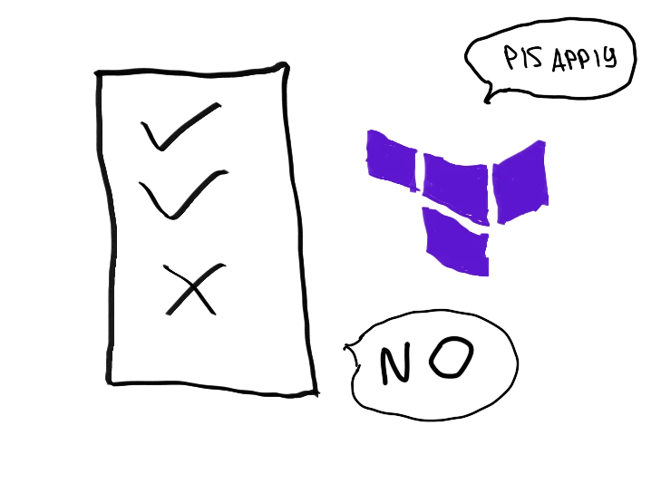

---
authors:
  - hatedabamboo
date:
  created: 2024-06-28
slug: checking-iam-policy-length-using-terraform
tags:
  - aws
  - iam
  - terraform
title: "Checking IAM policy length using Terraform"
---
Terraform, apart from being an incredible tool overall, is very good for
managing IAM policies: it's straightforward, easy to maintain, and very
flexible. I've seen a lot of guides on using Terraform for managing
infrastructure in general and IAM specifically, but I haven't seen any
implementing an important but not very common feature — validating IAM policy
length. So I decided to create one.

<!-- more -->



## The problem

I'm sure 90% of IAM policies look like this:

```json
{
  "Version": "2012-10-17",
  "Statement": [
    {
      "Sid": "AllowS3Access",
      "Effect": "Allow",
      "Action": [
        "s3:*"
      ],
      "Resource": "*"
    }
  ]
}
```

Which may be totally fine based on your needs. This policy, however, is not
very close to the Well-Architected Framework's "least privilege" design
principle[^1]. Keeping with the tone of WAF, the policy should be narrowed to
only necessary actions on necessary resources, e.g.:

```json
{
  "Version": "2012-10-17",
  "Statement": [
    {
      "Sid": "AllowS3Access",
      "Effect": "Allow",
      "Action": [
        "s3:Describe*",
        "s3:Get*",
        "s3:List*",
      ],
      "Resource": [
        "arn:aws:s3:::my-cool-bucket",
        "arn:aws:s3:::my-cool-bucket/*"
      ]
    }
  ]
}
```

Narrowing this policy reduced its functionality but not its size. If we further
fine-tune the functionality, the size of the policy will increase. In medium
and small-sized projects, this may not be an issue, but in large projects with
many users, resources, accounts, and restrictions, this may become problematic.
The reason is AWS's limit for the size of policies: 6144 non-whitespace
characters. Splitting one large policy into several smaller ones may work until
you reach the hard limit of 20 policies per role[^2].

## Monitoring the size of the policy

But this post is not about how to deal with bloated policies (splitting them
up, using wildcards, etc.); it's about the ability to monitor the size of a
single policy using Terraform.

Terraform has a function `length`[^3], which, when provided with a string, will
calculate the number of characters in it. So, how do we get a policy in the
form of a string? This can be achieved by using the `aws_iam_policy_document`
data source:

```hcl
data "aws_iam_policy_document" "example" {
  statement {
    sid    = "AllowS3Access"
    effect = "Allow"
    actions = [
      "s3:Describe*",
      "s3:Get*",
      "s3:List*"
    ]
    resources = [
      "arn:aws:s3:::my-cool-bucket",
      "arn:aws:s3:::my-cool-bucket/*"
    ]
  }
}
```

This policy can be referenced in the `aws_iam_policy` resource:

```hcl
resource "aws_iam_policy" "example" {
  name   = "example-allow-s3-access"
  policy = data.aws_iam_policy_document.example.json
}
```

And finally, the cherry on top: validating if the policy actually fits:

```hcl
resource "aws_iam_policy" "example" {
  name   = "example-allow-s3-access"
  policy = data.aws_iam_policy_document.example.json

  lifecycle {
    precondition {
      condition     = length(replace(replace(data.aws_iam_policy_document.example.json, " ", ""), "\n", "")) < 6144
      error_message = "Length of the policy is more than 6144 symbols, current length is: ${length(replace(replace(data.aws_iam_policy_document.example.json, " ", ""), "\n", ""))}"
    }
  }
}
```

Let me elaborate a bit on what's happening here:

1. The `lifecycle` block defines the behavior of the resource. In this case, we
define `precondition`, a condition that will be evaluated before Terraform
attempts to create the resource.
2. In `condition`, we calculate the length of the policy string
(`data.aws_iam_policy_document.example.json`). First, we remove newline (`\n`)
characters using the `replace`[^4] function (inner), then we remove whitespace
characters (outer `replace` function), and then we count the number of
characters in the remaining string using the `length` function.
3. If the amount is greater than the provided limit (6144), we show an error
message.

```shell
╷
│ Error: Resource precondition failed
│ 
│   on main.tf line 123, in resource "aws_iam_policy" "example":
│  123:       condition     = length(replace(replace(data.aws_iam_policy_document.example.json, " ", ""), "\n", "")) < 6144
│     ├────────────────
│     │ data.aws_iam_policy_document.example.json is "[REDACTED]"
│     │ var.policy_length_limit is 6144
│ 
│ Length of the policy is more than 6144 symbols, current length is: 6150
╵
```

This way, we can catch the situation when the policy exceeds the allowed
length during the plan stage instead of during the apply stage.

!!! abstract "Closing remarks"

    As always, feel free to
    [disagree](https://github.com/hatedabamboo/notes.hatedabamboo.me/issues) with
    me, [correct](https://github.com/hatedabamboo/notes.hatedabamboo.me/pulls) my
    mistakes and befriend me on one of the social media platforms listed below.

[^1]: [Design principles](https://docs.aws.amazon.com/wellarchitected/latest/framework/sec-design.html)
[^2]: [IAM object quotas](https://docs.aws.amazon.com/IAM/latest/UserGuide/reference_iam-quotas.html#reference_iam-quotas-entities)
[^3]: [length Function](https://developer.hashicorp.com/terraform/language/functions/length)
[^4]: [replace Function](https://developer.hashicorp.com/terraform/language/functions/replace)
