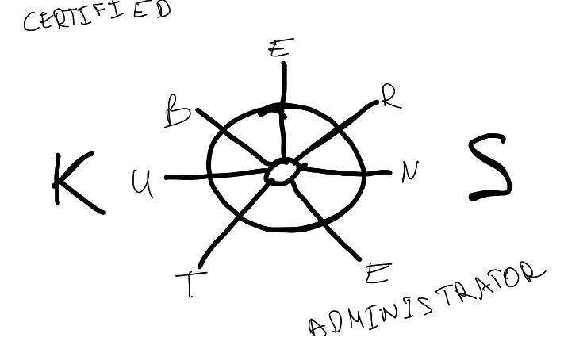

---
authors:
  - hatedabamboo
date:
  created: 2024-03-13
slug: cka-or-not-cka
tags:
  - certification
  - kubernetes
title: "CKA or not CKA: my thoughts about certification and stuff"
---
To certify or not to certify? That is a complicated question. In this post, I
will speculate on the topic and share my personal thoughts on certifications in
 general, specifically focusing on the CKA.

<!-- more -->

## It's Been 84 Years…

It's been almost three months since my last post, all due to preparation for
the CKA (Certified Kubernetes Administrator) exam. (I assure you, this was the
reason, not the fact that I play video games every day.)

## CKA: The Path to Tread

What did the preparation consist of?

I took the simplest approach. I googled "CKA preparation", and I found numerous
great documents with the same purpose: to compile resources in one place to
help you easily prepare for the examination. They all share almost identical
resources:

- Official Kubernetes documentation
- List of topics covered by the exam
- Video course on Kubernetes by KodeKloud (created specifically for CKA
certification[^1])

Basically, this is it. This is the amount of theory you will need to delve into
the topic from ground zero, and I'm not kidding.

The aforementioned video course helps understand all the concepts of the inner
Kubernetes structure and resources. It's very thorough and well-structured.

The most important part (in my opinion), however, is practice. And practice is
what will help you pass the exam in the end. After all, the exam is
performance-based.

To properly prepare for the exam, one must be familiar with the terminal and
all basic `kubectl` commands. In this regard, I found the KLLRCODA
playgrounds[^2] very helpful. Besides having scenario-based
playgrounds, they also have an open free-for-all playground, although
time-limited for free users.

In contrast to Killercoda, KodeKloud (oh gods, why so many Ks in their names)
offers multiple practice labs on each topic. Although tasks are not very
complicated, they provide predefined environments with errors, so you don't
have to set them up manually beforehand. Additionally, the KodeKloud course
includes several mock exams, which are somewhat similar to the actual exam.

But the ultimate killer feature among all resources is
killer.sh[^3] (created by the same guys as Killercoda) mock
exams, which come included with the CKA exam purchase. These preparation exams
don't mess around: their mock tasks are complicated, timed, and very
thoughtfully prepared. If you wish to pass the actual exam with ease, killer.sh
mocks are the best way to get the hang of it.

In summary, a few weeks of theory, a week of intense exercises with practice
tasks, labs, or exams, and you're good to go.

## Certifications: To Do Or Not To Do

Totally different question is the necessity of certifications themselves.

I would dissect this topic from two perspectives: when your employer covers the
cost of certification and when you have to pay for it out of your own pocket.

### Scenario One: Your Employer Covers Certification Costs

In my opinion, this is a rather easy question. If you don't have to pay 100-400
bucks for the virtual badge, the knowledge and skills that come with it are
super handy, especially if you have some spare time in the upcoming two months
(1-2 hours a day).

### Scenario Two: You Pay for the Stuff Yourself

This is where the fun begins. As the final decision is left to the individual,
I will share my thoughts on this topic.

Certifications as a means of confirming one's knowledge of a topic are useless.
They do not necessarily confirm that a person is proficient within the field.
For all we know, the individual could have only mastered the material to pass
the certification exam, with actual skills or understanding of tasks being
lacking.

However, certifications in IT industry created a vast variety of preparation
courses and learning tools. They often contain well-refined, concentrated
material covering theoretical, and sometimes practical, aspects of the topic.
Thus, these courses can be an incredible resource for delving into a subject,
should the need arise. I, for one, managed to get aquainted with the basic
elements of AWS infrastructure thanks to such a course in just three months. It
provided a significant boost to my professional development.

So, if one desires to delve into a specific topic or tool, they can seek out
courses on the matter. Whether free or paid, the choice is theirs, but
investing in paid courses often fosters greater interest and commitment.
Additionally, it's worth noting that courses frequently go on sale (yep, just
like games on Steam). As for certificates, they may not necessarily be
essential. They primarily demonstrate that one is organized enough to pass an
exam and has some spare money.

It's important to mention that in certain scenarios, obtaining a certificate
may be necessary to secure a new job. In such cases, pursuing the certificate
becomes a solid and direct investment in one's future: go for it.

!!! abstract "Closing remarks"

    As always, feel free to
    [disagree](https://github.com/hatedabamboo/notes.hatedabamboo.me/issues) with
    me, [correct](https://github.com/hatedabamboo/notes.hatedabamboo.me/pulls) my
    mistakes and befriend me on one of the social media platforms listed below.

[^1]: [Certified Kubernetes Administrator (CKA) with Practice Tests](https://www.udemy.com/course/certified-kubernetes-administrator-with-practice-tests/)
[^2]: [Killercoda](https://killercoda.com/)
[^3]: [Killer Shell](https://killer.sh/)
