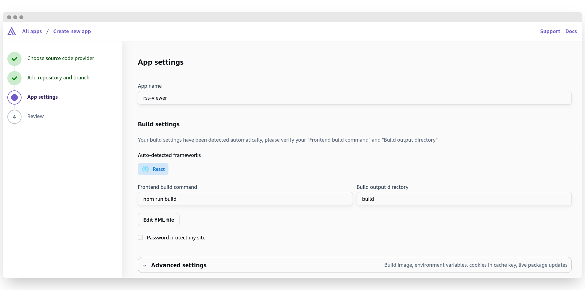
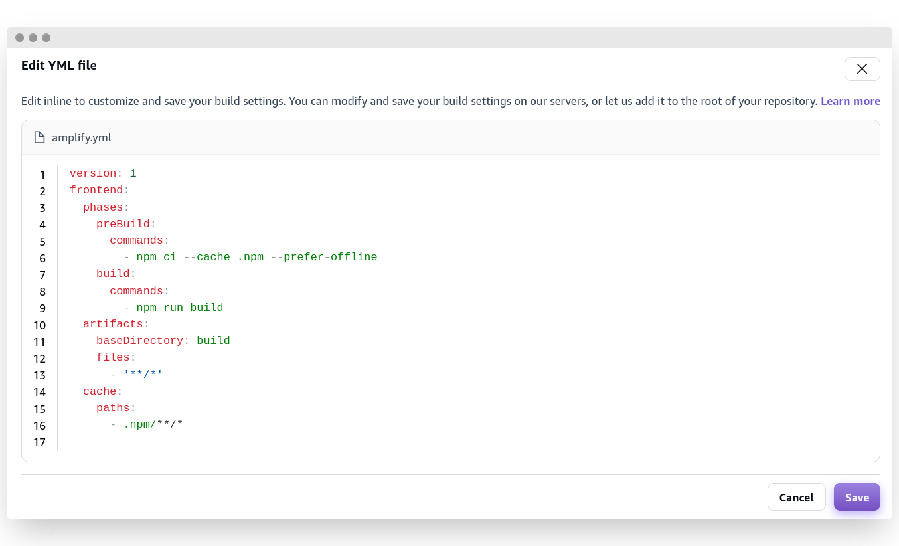
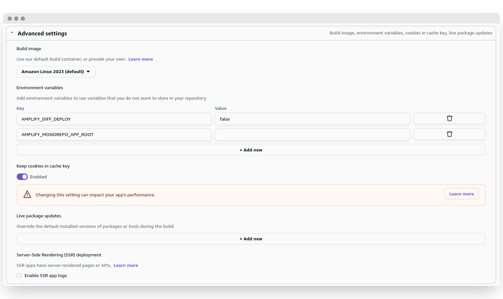

AWS has long allowed users to host their static websites using S3 buckets. While this is a very simple and reliable solution, sometimes there is a need for a more complex application. AWS addresses this need with AWS Amplify Gen 2. In this article, I'm going to show you how to create and serve a React application utilizing its power.

<!-- more -->

## What is AWS Amplify?

As AWS puts it:

!!! quote "Amplify Documentation"

    AWS Amplify is everything frontend developers need to develop and deploy cloud-powered fullstack applications without hassle. Easily connect your frontend to the cloud for data modeling, authentication, storage, serverless functions, SSR app deployment, and more.

All this sounds very modern, very fancy and very desirable. That's I don't want to hear. In fact, I'm more interested in how it works, what opportunities this service creates for me as an engineer and how it can improve or simplify existing solutions. Let's take a look.

The bulk of Amplify functionality is built around TypeScript and it's frameworks. This allows a huge amount of JavaScript developers to utilize familiar language to build full-stack application and even it's UI. Amplify takes all the chore of setting up, configuring and maintaining underlying infrastructre, deploying and hosting the application, leaving developers with the task of only writing the code.

Amplify supports connection to several git providers: CodeCommit (of course), GitHub, GitLab and BitBucket. Integration with VCS allows for the ease of development. Each new branch maps directly to a new environment, simplifying development with the usage of several preview branches simultaneously without need to configure each environment separately.

Actually, this approach is not new on the public cloud horizon oriented on JavaScript development. Several major players on the market, such as Vercel, Fly.io, Netify and Heroku (to name a few), have been providing similar functionality for some time now already. Some even went as far as creating their own framework for web applications[^1].

So what does AWS Amplify has to offer that other competitors do not have already?

I feel that one the most important benefits from Amplify side is that it's an AWS product. This is shown by already preconfigured integration with such services as Cognito for authentication, DynamoDB for data storage, S3 for document storage, AWS Lambda for function execution, and many many more[^2].

A nice bonus from AWS is the ability to configure your own hosted zone using Route 53, which also means easy domain name management: create as many domains and subdomains as you like, all automated thanks to Amplify. And a cherry on top: with domain names come automated TLS certificate management. No more Certbot crons, yes more HTTPS!

## Deploying example React application with Amplify

I learned about Amplify when I was browsing through my buckets for my previous[^3] post. As you probably heard, my website is statically hosted on S3. And now in this configuration block AWS shows a plaque suggesting to deploy a website using Amplify as a modern way.

I decided to give it a try and compare the results. This way a beta[^4] version of my landing appeared appeared. The whole process took me a surprisingly small amount of time. Amplify takes care of CloudFront configuration and helps to set up proper domain names (both in Route 53 and on external services).
Instead of creating a bucket with the static website contents, creating a CloudFront distribution pointing to this bucket, creating a second bucket with the `www` in the addreess to point to the main bucket, configuring aliases for 

I wasn't satisfied with the necessary effort to base my new blog post upon, so I started thinking. What is the project that I had in my mental backlog that can be both complex enough to write about and simple enough to implement? The result was the RSS Veiwer[^5]: a single-page application that does one thing. It shows a pretty formatted RSS feed should it be provided with a link to it.

I am not a JavaScript developer, so I tried to keep the thing as simple as possible. I wanted the application to be simple, minimalistic, with the lowest amount of overhead possible (Oh silly, young and naive me wasn't yet fully aware of the world of the JS dependency hell.)

I asked my fellow writing assistant to describe to me the application composition and write the necessary boilerplate code so I will be able to fix it and make it work. It took some attempts and one hour or so, but in the end the working application emerged and successfully made it's way to GitHub.

Now, let's finally deliver the application using Amplify!

First step is to connect the application repository to the Amplify project.

Select GitHub and click "Next". You are able to use any git provider you want. You can even use S3 bucket as a source for your code. My application is stored on GitHub, so I select this option. You're also provided with an option to start a new project from scratch: using Next.js app router, Vue, Angular or Vite. But these options are out of the scope of the current article.

Upon entering this screen the window will open with request to grant permissions to Amplify to your repository. Grant necessary permissions and procees with selecting repository from the first window. Select your main branch from the window below, default name for in is, well, "main". If your app is the only thing that resides in the repository, just like mine, it makes sense to mark "My app is a monorepo" checkbox and select the root directory for the application. For my application the root directory is `src/`. Selecting all the options we're ready to proceed. Click "Next".

On this step we have several things to configure and several things that are detected automatically. Amplify detects the framework that has been used to develop the application and proposes corresponding commands to build the code and output directory. Hey, but we can set the name of our application! That's something, right?

Actually, by clicking "Edit YML file" we can see the whole workflow file that will be used to build the application, and configure it to our liking. It looks a lot like GitHub Actions Workflow file or GitLab CI file.

Advanced settings allow us to granularly configure the image that we want to use for building the application; specify environment variables for storing sensitive information or using feature flags; keep cookies in cache key; override default versions of packages during the build time; and enable server-side rendering app logs.

The last screen shows an overview of all the options selected previously. Review them (just to be sure) and click "Save and deploy".

After several seconds you'see the main overview window of your new application. It will take several minutes to fully deploy, but after the status turns green and shows "Deployed" you will be able to reach your app on the link below.

Looks nice and easy so far!

The main menu on the left side allows to review and adjust already configured options (such as build settings, environment variables and git repository configuration) as well as some new tricks: access control, custom domains, rewrites and redirects, secrets and monitoring.

Let's focus with more detail on custom domains.

At this moment we have only one address assigned to us by Amplify. This is hardly a nice looking link for production ready application, more like a project work in progress. Notice the URL: `main` part after the protocol shows us that this is the deployment of the `main` branch from the git repository. Very straightforward indeed! Let's add a custom domain to our application.

I already have a domain name registered in Route 53 (as you can see on the screenshot), so I can easily select it from the dropdown list. Click "Configure domain".

This is the page where we can configure our custom subdomains. The first line proposes to deploy my application to my domain. However, since I already use this domain for my website[^4], I will exclude root. This leaves us with the second option. I will assign my `main` branch to `rss` subdomain.

With option "Automatic subdomain creation" you can elevate your preview branching approach even further: for example, instead of `main.123456abcdefg.amplifyapp.com` you can use `main.yourdomain.com` addresses, which is very convenient in my opinion, if not simply easy and pretty.

If you already have a certificate issued for your domain by AWS (as I do), you can select this certificate in drop-down menu under "Custom SSL certificate". Otherwise Amplify will issue one for you.

<!-- perhaps paste here difference between two: self-issues by aws and Amplify-issued -->

If you're happy with the results, click "Save" and let the custom domain deploys.

This is the most time-consuming step in the whole process, no thanks to the DNS. I've seen issues with this step before, no wonder why AWS added a direct link to troubleshooting guide right below this block.

After several minutes of waiting, the new custom domain should be available and you will be able to reach you application on the specified URL.

## Conclusion

And thus concludes the guide of deploying your own React application with the help of AWS Amplify. As you can see, the whole process is very straightforward and very easy to repeat. AWS helps with all the heavy lifting a lot, trust an experienced DevOps engineer on this: I've had my fair share of deployment configuration and setting pipelines up. It warms my heart to see that more and more people will be able to leverage advancement of 1-click deployments instead of spending countless hours, sweat, tears and blood trying to figure out why the project is not being built correctly (hello, missing backslash in multiline yaml!).

Happy developing, happy holidays, and most likely see ya in the next year!

!!! abstract "Closing remarks"

    As always, feel free to
    [disagree](https://github.com/hatedabamboo/notes.hatedabamboo.me/issues) with
    me, [correct](https://github.com/hatedabamboo/notes.hatedabamboo.me/pulls) my
    mistakes and befriend me on one of the social media platforms listed below.

[^1]: [Next.js by Vercel - The React Framework](https://nextjs.org/)
[^2]: [Add any AWS service](https://docs.amplify.aws/react/build-a-backend/add-aws-services/)
[^3]: [Hidden files in an S3 bucket](https://notes.hatedabamboo.me/hidden-files-in-s3-bucket/)
[^4]: [beta.hatedabamboo.me](https://beta.hatedabamboo.me)
[^5]: [RSS Viewer](https://rss.hatedabamboo.me)
